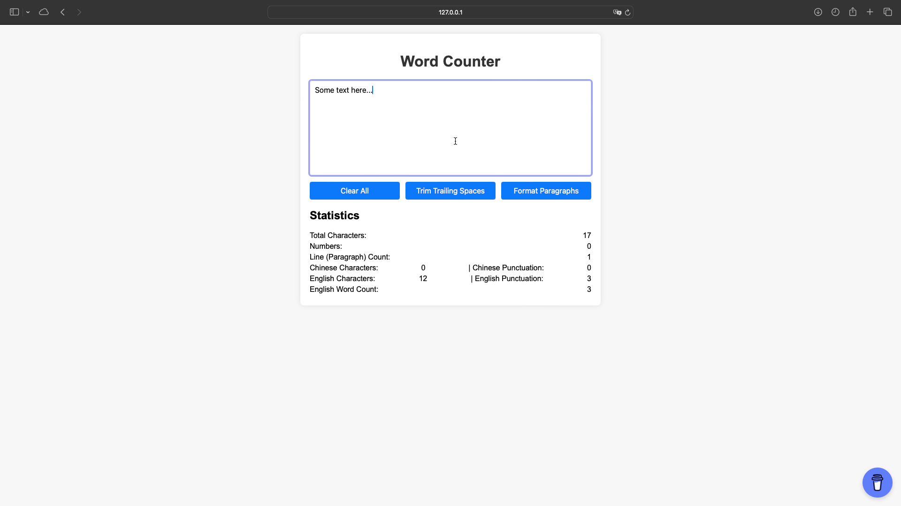

# Word Counter

## Description

The Word Counter is a web-based application designed to analyze and provide statistics for a given text. It can count characters, numbers, paragraphs, and various types of punctuation. It also includes options to clear the text, trim trailing spaces, and format paragraphs.

## Features

- **Text Analysis:**
  - Total character count
  - Number count
  - Line (paragraph) count
  - Chinese character and punctuation count
  - English character, punctuation, and word count

- **Text Manipulation:**
  - Clear all text
  - Trim trailing spaces
  - Format paragraphs

## Usage

1. **Enter Text:**
   - Type or paste your text into the textarea provided.

2. **Clear Text:**
   - Click the "Clear All" button to remove all text from the textarea.

3. **Trim Trailing Spaces:**
   - Click the "Trim Trailing Spaces" button to remove any trailing spaces from each line of text.

4. **Format Paragraphs:**
   - Click the "Format Paragraphs" button to format the text into paragraphs.

5. **View Statistics:**
   - The statistics section will automatically update to display the analysis of the entered text:
     - Total characters
     - Numbers
     - Line (paragraph) count
     - Chinese characters and punctuation
     - English characters, punctuation, and word count

## Screenshot

## License

This project is licensed under the MIT License. See the LICENSE file for details.

## Support

If you find this project helpful, please consider supporting me on [Buy Me a Coffee](https://www.buymeacoffee.com/york0524).